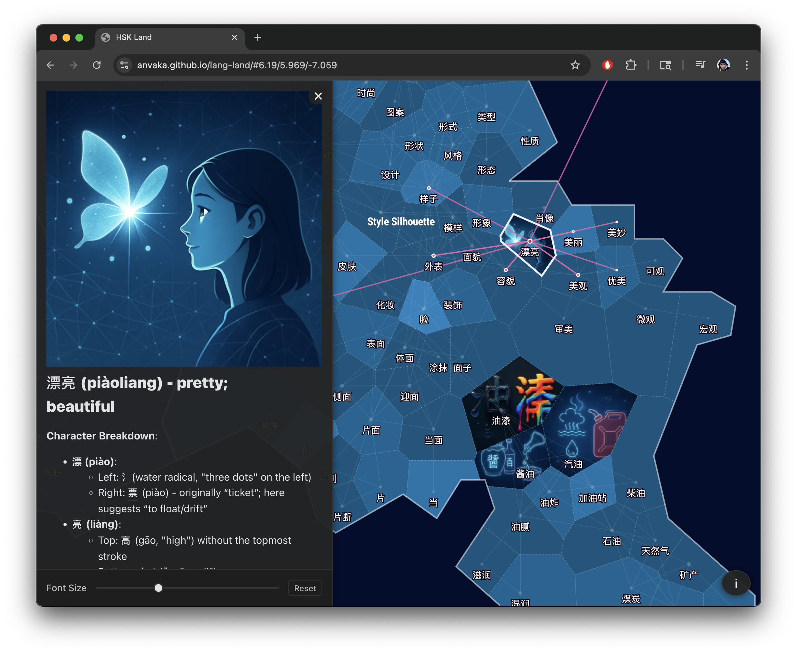
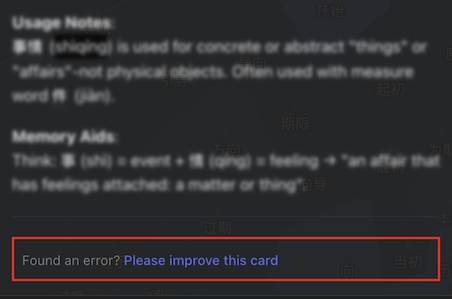

# Lang-Land (HSK Land)

An interactive visualization of 5,000 Chinese flashcards from the HSK vocabulary list, arranged by meaning
similarity. Discover the new world of flashcards: https://anvaka.github.io/lang-land/

[](https://anvaka.github.io/lang-land/)

## Overview

HSK Land is an interactive map that visualizes Mandarin Chinese vocabulary, grouping similar words together
based on their meanings. It provides a unique way to explore and learn Chinese vocabulary by seeing connections
between related words. When you click on any word, you'll see:

- Word definitions
- Usage examples
- Character breakdowns
- Visual aids (when available)

Words that are semantically related are positioned closer together on the map, creating a "landscape of meaning"
that helps learners discover connections between concepts.

Clicking on a tile - is like discovering new land - it shows you both the flashcard, and an artistic image to 
memorize the word better. The map is designed to be both educational and visually appealing, making language learning
more fun.

## Contributors Wanted

As a fellow language learner building this tool for myself, I know how much accurate flashcards matter. 
The truth is, I used ChatGPT to generate most of the translations and breakdowns, and while it's pretty good,
it definitely makes mistakes.

### How You Can Help

In the sidebar of each flashcard, you'll find a link to edit the card on GitHub:



**Spot the Errors**
- Fix translation mistakes or awkward phrasing  
- Suggest better example sentences that show real usage
- Correct character breakdowns and pronunciation

**Make It Better**
- Improve definitions to be more learner-friendly
- Add cultural context where it helps
- Share memory tricks that worked for you

**It's Really Easy**
Click "Edit this card" at the bottom of any flashcard, make your changes in GitHub, and submit.
I review everything and merge quickly. No coding skills needed - GitHub's editor is straightforward.

### What I'm Looking For

I'd rather have someone fix one obviously wrong translation than write perfect documentation.
Think about what would have helped you when you were learning that word. Real examples beat textbook sentences every time.

### A Small Thank You

Every contributor gets credit in the commit history. For bigger improvements, I'll mention you in the release notes.
But honestly, the real reward is knowing you've made learning easier for thousands of other students.

If you're new to GitHub, don't let that stop you. There are good tutorials out there, and the edit interface is
pretty user-friendly. Even small fixes make a difference.

Jump in and help make it better~

## Development

### Setup

1. Clone the repository:
   ```sh
   git clone https://github.com/anvaka/lang-land.git
   cd lang-land
   ```

2. Install dependencies:
   ```sh
   npm install
   ```

3. Start the development server:
   ```sh
   npm run dev
   ```

4. Open your browser at http://localhost:5173/

### Build for Production

```sh
npm run build
```

## Support

If you find this project useful, consider [supporting it](http://paypal.com/paypalme/anvakos/5). 
Image generation costs money and by showing your support you help me keep this project alive and improve it further.

PS: If you would like to create a similar map - please reach out to me on [Twitter](https://x.com/anvaka) and I will be happy to help you.

With ❤️, Anvaka 